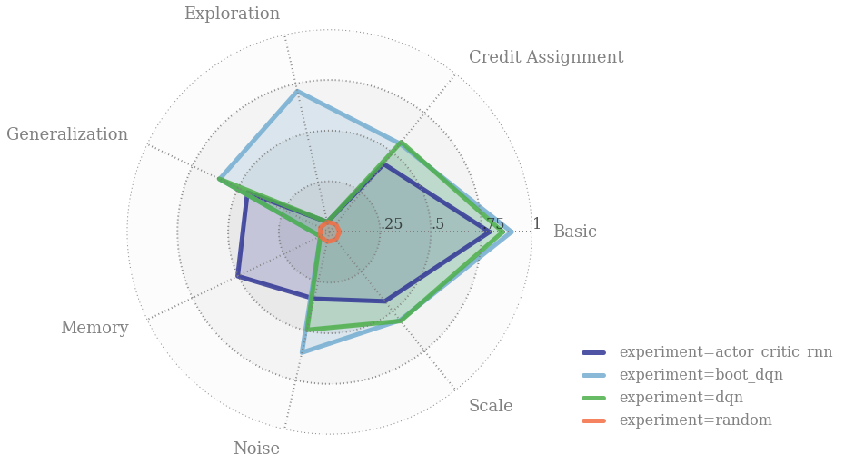

# Behaviour Suite for Reinforcement Learning (`bsuite`)




## Introduction

`bsuite` is a collection of carefully-designed experiments that investigate core
capabilities of a reinforcement learning (RL) agent with two main objectives.

1.  To collect clear, informative and scalable problems that capture key issues
    in the design of efficient and general learning algorithms.
2.  To study agent behavior through their performance on these shared
    benchmarks.

This library automates evaluation and analysis of any agent on these benchmarks.
It serves to facilitate reproducible, and accessible, research on the core
issues in RL, and ultimately the design of superior learning algorithms.

Going forward, we hope to incorporate more excellent experiments from the
research community, and commit to a periodic review of the experiments from a
committee of prominent researchers.

For a more comprehensive overview, see the accompanying [paper].

## Technical overview

`bsuite` is a collection of _experiments_, defined in the [`experiments`]
subdirectory. Each subdirectory corresponds to one experiment and contains:

-   A file defining an RL environment, which may be configurable to provide
    different levels of difficulty or different random seeds (for example).
-   A sequence of keyword arguments for this environment, defined in the
    `SETTINGS` variable found in the experiment's `sweep.py` file.
-   A file `analysis.py` defining plots used in the provided Jupyter notebook.

`bsuite` works by logging results from "within" each environment, when loading
environment via a
[`load_and_record*` function](#loading-an-environment-with-logging-included).
This means any experiment will automatically output data in the correct format
for analysis using the notebook, without any constraints on the structure of
agents or algorithms.

We collate all of the results and analysis in a pre-made jupyter notebook [bit.ly/bsuite-colab](https://bit.ly/bsuite-colab).

## Getting started

If you are new to `bsuite` you can get started in our
[colab tutorial](https://colab.research.google.com/drive/1rU20zJ281sZuMD1DHbsODFr1DbASL0RH).
This Jupyter notebook is hosted with a free cloud server, so you can start
coding right away without installing anything on your machine. After this, you
can follow the instructions below to get `bsuite` running on your local machine.

### Installation

We have tested `bsuite` on Python 3.6 & 3.7. To install the dependencies:

1.  **Optional**: We recommend using a
    [Python virtual environment](https://docs.python.org/3/tutorial/venv.html)
    to manage your dependencies, so as not to clobber your system installation:

    ```bash
    python3 -m venv bsuite
    source bsuite/bin/activate
    pip install --upgrade pip setuptools
    ```

1.  Install `bsuite` directly from [PyPI](https://pypi.org/project/bsuite):

    ```bash
    pip install bsuite
    ```

1.  **Optional**: To also install dependencies for the [`baselines`] examples
    (excluding OpenAI and Dopamine examples), run:

    ```bash
    pip install bsuite[baselines]
    ```

## Environments

Complete descriptions of each environment and their corresponding experiments
are found in the [`analysis/results.ipynb`] Jupyter notebook.

These environments all have small observation sizes, allowing for reasonable performance with a small network on a CPU.

### Loading an environment

Environments are specified by a `bsuite_id` string, for example `"deep_sea/7"`.
This string denotes the experiment and the (index of the) environment settings
to use, as described in the [technical overview section](#technical-overview).

For a full description of each environment and its corresponding experiment settings, see the [paper].

```python
import bsuite

env = bsuite.load_from_id('catch/0')
```

The sequence of `bsuite_id`s required to run all experiments can be accessed
programmatically via:

```python
from bsuite import sweep

sweep.SWEEP
```

This module also contains `bsuite_id`s for each experiment individually via
uppercase constants corresponding to the experiment name, for example:

```python
sweep.DEEP_SEA
sweep.DISCOUNTING_CHAIN
```

In addition, sequences of `bsuite_id`s with the same tag can be loaded via:

```python
from bsuite import sweep

sweep.TAGS
```

The `TAGS` variable groups `bsuite` environments together by their underlying
tag, so all the `basic` tasks or `scale` tasks can be loaded with:

```python
sweep.TAGS['basic']
sweep.TAGS['scale']
```

### Loading an environment with logging included

We include two implementations of automatic logging, available via:

*   [`bsuite.load_and_record_to_csv`]. This outputs one CSV file per
    `bsuite_id`, so is suitable for running a set of bsuite experiments split
    over multiple machines. The implementation is in [`logging/csv_logging.py`]
*   [`bsuite.load_and_record_to_sqlite`]. This outputs a single file, and is
    best suited when running a set of bsuite experiments via multiple processes
    on a single workstation. The implementation is in
    [`logging/sqlite_logging.py`].

We also include a terminal logger in [`logging/terminal_logging.py`], exposed
via `bsuite.load_and_record_to_terminal`.

It is easy to write your own logging mechanism, if you need to save results to a
different storage system. See the CSV implementation for the simplest reference.

### Interacting with an environment

Our environments implement the Python interface defined in
[`dm_env`](https://github.com/deepmind/dm_env).

More specifically, all our environments accept a discrete, zero-based integer
action (or equivalently, a scalar numpy array with shape `()`).

To determine the number of actions for a specific environment, use

```python
num_actions = env.action_spec().num_values
```

Each environment returns observations in the form of a numpy array.

We also expose a `bsuite_num_episodes` property for each environment in bsuite.
This allows users to run exactly the number of episodes required for bsuite's
analysis, which may vary between environments used in different experiments.

Example run loop for a hypothetical agent with a `step()` method.

```python
for _ in range(env.bsuite_num_episodes):
  timestep = env.reset()
  while not timestep.last():
    action = agent.step(timestep)
    timestep = env.step(action)
  agent.step(timestep)
```

### Using `bsuite` in 'OpenAI Gym' format

To use `bsuite` with a codebase that uses the
[OpenAI Gym](https://github.com/openai/gym) interface, use the `GymFromDMEnv`
class in [`utils/gym_wrapper.py`]:

```python
import bsuite
from bsuite.utils import gym_wrapper

env = bsuite.load_and_record_to_csv('catch/0', results_dir='/path/to/results')
gym_env = gym_wrapper.GymFromDMEnv(env)
```

Note that `bsuite` does not include Gym in its default dependencies, so you may
need to pip install it separately.

## Baseline agents

We include implementations of several common agents in the [`baselines/`]
subdirectory, along with a minimal run-loop.

See the [installation](#installation) section for how to include the required
dependencies at install time. These
dependencies are not installed by default, since `bsuite` does not require users
to use any specific machine learning library.

## Running the entire suite of experiments

Each of the agents in the `baselines` folder contains a `run` script which
serves as an example which can run against a single environment or against the
entire suite of experiments, by passing the `--bsuite_id=SWEEP` flags; this will
start a pool of processes with which to run as many experiments in parallel as
the host machine allows. On a 12 core machine, this will complete overnight for
most agents. Alternatively, it is possible to run on Google Compute Platform
using `run_on_gcp.sh`, steps of which are outlined below.

### Running experiments on Google Cloud Platform

[`run_on_gcp.sh`](run_on_gcp.sh) does the following in order:

1.  Create an instance with specified specs (by default 64-core CPU optimized).
1.  `git clone`s `bsuite` and installs it together with other dependencies.
1.  Runs the specified agent (currently limited to `/baselines`) on a specified
    environment.
1.  Copies the resulting SQLite file to `/tmp/bsuite.db` from the remote
    instance to you local machine.
1.  Shuts down the created instance.

In order to run the script, you first need to create a billing account. Then
follow the instructions
[here](https://cloud.google.com/sdk/docs/quickstart-debian-ubuntu) to setup and
initialize Cloud SDK. After completing `gcloud init`, you are ready to run
`bsuite` on Google Cloud.

For this make [`run_on_gcp.sh`](run_on_gcp.sh) executable and run it:

```bash
chmod +x run_on_gcp.sh
./run_on_gcp.sh
```

After the instance is created, the instance name will be printed. Then you can
ssh into the instance by selecting `Compute Engine -> Instances` and clicking
`SSH`. Note that this is not necessary, as the result will be copied to your
local machine once it is ready. However, `ssh`ing might be convenient if you
want to make local changes to agent and environments. In this case, after
`ssh`ing, do

```bash
~/bsuite_env/bin/activate
```

to activate the virtual environment. Then you can run agents via

```bash
python ~/bsuite/bsuite/baselines/dqn/run.py --bsuite_id=SWEEP
```

for instance.

### Analysis

`bsuite` comes with a ready-made analysis Jupyter notebook included in
[`analysis/results.ipynb`]. This notebook loads and processes logged data, and
produces the scores and plots for each experiment. We recommend using this
notebook in conjunction with [Colaboratory](https://colab.research.google.com).

We provide an example of a such `bsuite` report
[here](https://colab.research.google.com/drive/1RYWJaMEHVeN8yI83QtL35GOSFQBRgLaX).

### `bsuite` Report

You can use `bsuite` to generate an automated 1-page appendix, that summarizes
the core capabilities of your RL algorithm. This appendix is compatible with
most major ML conference formats. For example output run,

```bash
pdflatex bsuite/reports/neurips_2019/neurips_2019.tex
```

More examples of bsuite reports can be found in the `reports/` subdirectory.

## Citing

If you use `bsuite` in your work, please cite the accompanying [paper]:

```bibtex
@inproceedings{osband2020bsuite,
    title={Behaviour Suite for Reinforcement Learning},
    author={Osband, Ian and
            Doron, Yotam and
            Hessel, Matteo and
            Aslanides, John and
            Sezener, Eren and
            Saraiva, Andre and
            McKinney, Katrina and
            Lattimore, Tor and
            {Sz}epesv{\'a}ri, Csaba and
            Singh, Satinder and
            Van Roy, Benjamin and
            Sutton, Richard and
            Silver, David and
            van Hasselt, Hado},
    booktitle={International Conference on Learning Representations},
    year={2020},
    url={https://openreview.net/forum?id=rygf-kSYwH}
}
```

[`analysis/results.ipynb`]: bsuite/analysis/results.ipynb
[`baselines`]:  bsuite/baselines/
[`bsuite.load_and_record_to_csv`]: bsuite/bsuite.py
[`bsuite.load_and_record_to_sqlite`]: bsuite/bsuite.py
[`experiments`]:  bsuite/experiments/
[`logging/csv_logging.py`]: bsuite/logging/csv_logging.py
[`logging/sqlite_logging.py`]: bsuite/logging/sqlite_logging.py
[`logging/terminal_logging.py`]: bsuite/logging/terminal_logging.py
[`utils/gym_wrapper.py`]: bsuite/utils/gym_wrapper.py

[paper]: https://openreview.net/forum?id=rygf-kSYwH
